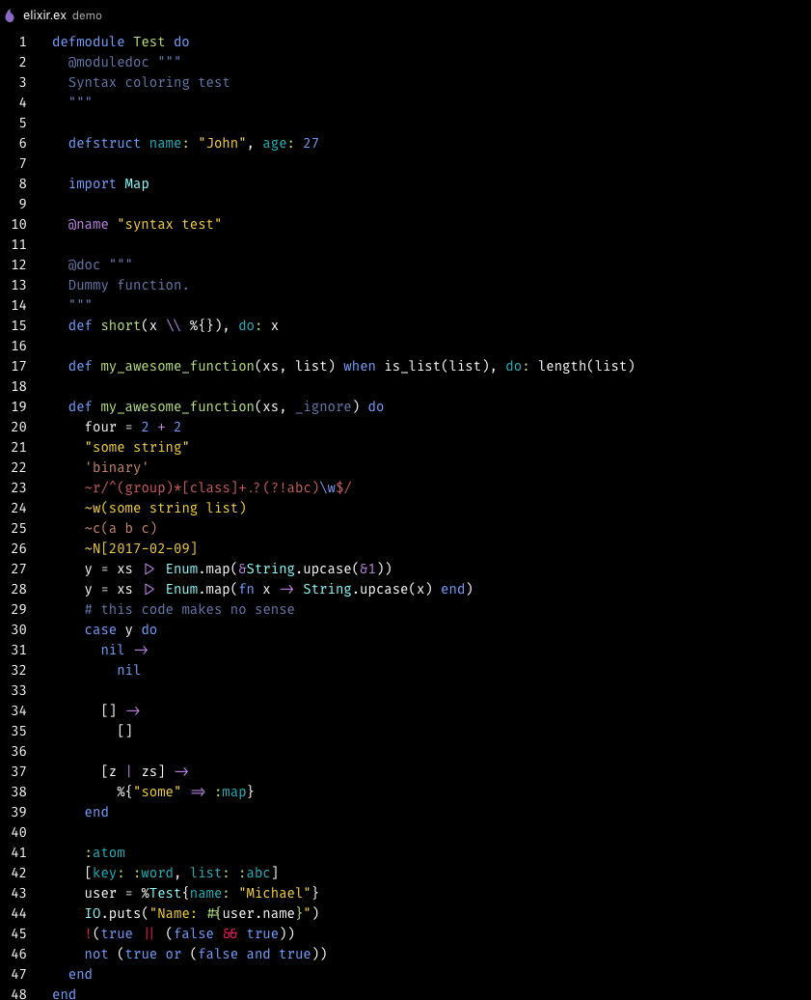

# Crispy Neon Theme
A high contrast theme with banging neon highlights for Visual Studio Code.

## Installation
1. Open Extensions sidebar panel in VS Code. View → Extensions
1. Search for `crispy neon`
1. Click **Install** to install it.
1. Click **Reload** to reload the your editor
1. Code > Preferences > Color Theme > Crispy Neon

## Licence
This theme is released under the [MIT License](https://github.com/MarcusHoile/crispy-neon/blob/master/LICENSE).
