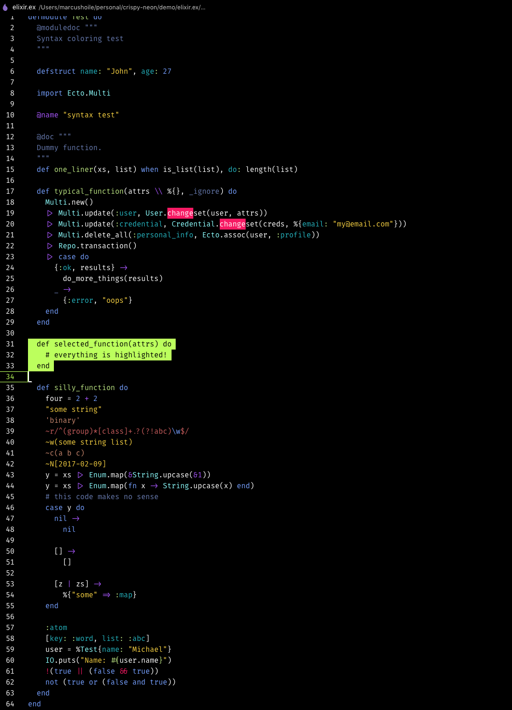

# Crispy Neon Theme
A high contrast theme with banging neon highlights for Visual Studio Code.



## Installation
1. Open Extensions sidebar panel in VS Code. View → Extensions
1. Search for `crispy neon`
1. Click **Install** to install it.
1. Click **Reload** to reload the your editor
1. Code > Preferences > Color Theme > Crispy Neon


## Recommended Settings
selection highlight colour `"#F81E6F"`

```json
    "editor.renderLineHighlight": "gutter",
    "workbench.colorCustomizations": {
        "editor.selectionHighlightBorder": "#000",
        "editor.lineHighlightBorder": "#C3FF68",
        "editorLineNumber.activeForeground": "#C3FF68",
        "selection.background": "#2bbac5",
        "editor.background": "#000000",
        "editor.selectionBackground": "#C3FF68"
    }
```

## Licence
This theme is released under the [MIT License](https://github.com/MarcusHoile/crispy-neon/blob/master/LICENSE).
